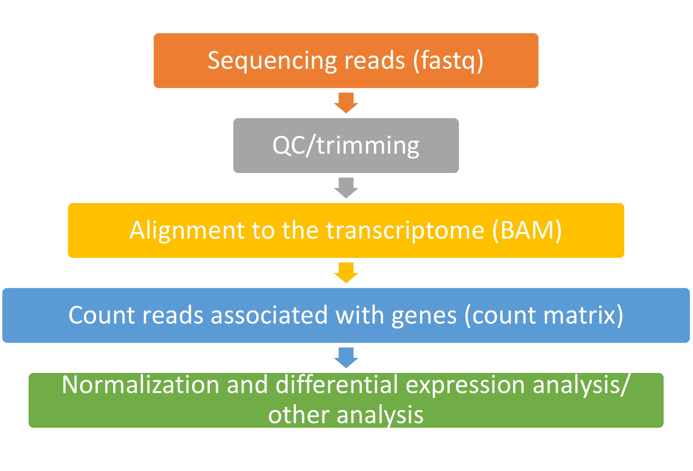

# RNA-seq analysis pipeline
#### September 12, 2018

## General pipeline

As you move down the pipeline, the files size and computing power decreses.

## QC 

- Program: [FASTQC](https://www.bioinformatics.babraham.ac.uk/projects/fastqc/)
- Tells ou the basic statistics on quality of sequencing data
- Can be used as part of a pipeline via bash programming or as interactive software

#### [Example of good data](https://www.bioinformatics.babraham.ac.uk/projects/fastqc/good_sequence_short_fastqc.html)

#### [Example of bad data](https://www.bioinformatics.babraham.ac.uk/projects/fastqc/bad_sequence_fastqc.html)

#### [Example of adapter read through](https://www.bioinformatics.babraham.ac.uk/projects/fastqc/small_rna_fastqc.html)

## Trimming reads

- Trims fastq files to only the biological information
- Used to trim reads for:
    * Length
    * Trim adapters or other known sequences from the reads
- [cutadapt](https://cutadapt.readthedocs.io/en/stable/guide.html) 

#### Trimming UMIs

UMIs are unique molecular tags that reduce PCR duplications.

- [UMI-tools](https://github.com/CGATOxford/UMI-tools)

## Aligning reads to the genome (or transcritpome)

Name | Type | Run time
--- | --- | ---
[Bowtie](http://bowtie-bio.sourceforge.net/bowtie2/index.shtml) | Unspliced read aligner | slow
[BWA](http://bio-bwa.sourceforge.net/) | Unspliced read aligner | slow
[TopHat](https://ccb.jhu.edu/software/tophat/manual.shtml) | Spliced read aligner | slow
[STAR](https://github.com/alexdobin/STAR/blob/master/doc/STARmanual.pdf) | Spliced read aligner | medium
[kallisto](https://pachterlab.github.io/kallisto/manual) | Pseudo-aligner | fast
[Salmon](https://salmon.readthedocs.io/en/latest/salmon.html) | Pseudo-aligner | fast

[Costa-Silva J, Domingues D, Lopes FM (2017) RNA-Seq differential expression analysis: An extended review and a software tool. 
PLoS ONE 12(12): e0190152](https://doi.org/10.1371/journal.pone.0190152) 

Found that for differential expression analysis the mapping tool had a minimal impact on the final result.

## Counting reads

Count the number of reads that align to each gene to measure gene expression.

Alignment method | Count tool
--- | ---
Bowtie, BWA, TopHat | Bedtools or htseq
STAR, kalliso, salmon | [Subread (package)](http://subread.sourceforge.net/) [featureCounts (function)](http://bioinf.wehi.edu.au/featureCounts/)

Also, the outputs from STAR, kallisto, and salmon aligners can go directly into edgeR for differential expression analysis. Kallisto and salmon outputs can go directly into sleuth for differential expression.

## Normalization

- _Counts per million_: scaled by total number of reads. Accounts for sequencing depth
- __Transcripts per kilobase million__: counts per length of transcript per million reads mapped. Accounts for squencing depth and gene length
- _Reads per kilobase of exon per million mapped reads_: Accounts for sequencing depth and gene length. _Warning_: Cannot compare between samples because total number of reads/sample is different.
- _Tool specific methods_: many differential expression packages have their own normalization methods

## Differential expression

- Best differential expression packages for low replicate numbers (<6 replicates):
    - [DESeq](https://bioconductor.org/packages/release/bioc/html/DESeq.html)
    - [edgeR](https://bioconductor.org/packages/release/bioc/html/edgeR.html)
- Easily done on any computer
- Uses R 
- Need a count matrix (can be generated from any BAM file from any aligner output)

#### How many replicates do you need to find differentially expressed genes?

- 3 replicates may be sufficient if there is at least a 2 fold change in expression, but 6 replicates is better
- 12 replicates results in identifying >90% of significanly expressed genes regardless of fold change.

[Schurch, N. J., et. al. (2016). How many biological replicates are needed in an RNA-seq experiment and which differential expression tool should you use? RNA, 22(6), 839–851](http://doi.org/10.1261/rna.053959.115)

## Enriched pathway analysis

Software type | Name
--- | ---
R package | [reactomePA](http://www.bioconductor.org/packages/devel/bioc/html/ReactomePA.html)
R package | [clusterProfiler](https://bioconductor.org/packages/release/bioc/html/clusterProfiler.html)
Free software | [Reactome](https://reactome.org/)
Free software | [GSEA](http://software.broadinstitute.org/gsea/index.jsp)
Online tool | [DAVID](https://david.ncifcrf.gov/)
Licenced software | [Ingenuity](https://www.qiagenbioinformatics.com/products/ingenuity-pathway-analysis/)

## Other analysis

#### Alternative splicing

- [spliceR](https://bmcbioinformatics.biomedcentral.com/articles/10.1186/1471-2105-15-81)
- [SGSeq](https://bioconductor.org/packages/release/bioc/vignettes/SGSeq/inst/doc/SGSeq.html)
- [PathwaySplice](https://academic.oup.com/bioinformatics/advance-article-abstract/doi/10.1093/bioinformatics/bty317/4983063?redirectedFrom=fulltext)

## Other resources

- [Command line crash course](https://learnpythonthehardway.org/book/appendixa.html)
- Learn R
    - [swirl](https://swirlstats.com/): Learn R in R
    - [IDPT 7810 006](https://ucdenver.instructure.com/courses/381582/assignments/syllabus): core module for data analysis in R
    - [Datacamp](https://www.datacamp.com/courses/free-introduction-to-r): Try the introdcution to R and the data manipulation with dplyr courses
- Data visualization in R
    - [ggplot2](https://ggplot2.tidyverse.org/)
    - [Heatmaps](https://www.rdocumentation.org/packages/stats/versions/3.5.1/topics/heatmap)
    - [Shiny](https://shiny.rstudio.com/): interactive apps

 
        